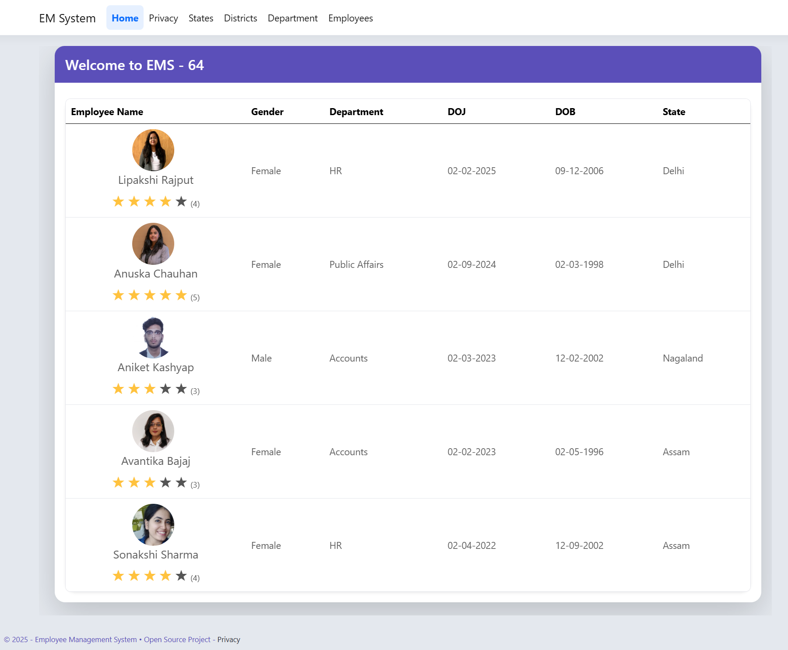
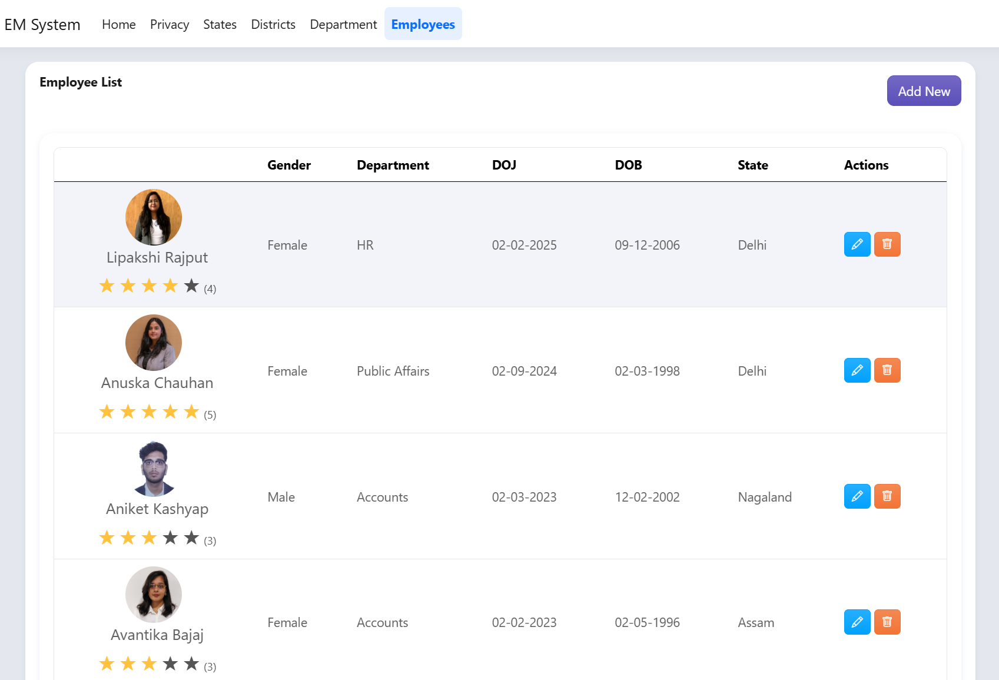
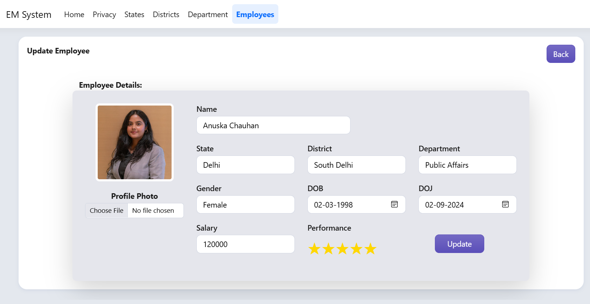

# 🧑‍💼 Employee Management System (ASP.NET Core Razor Pages)

A **Clean Architecture-based Employee Management System** built with **ASP.NET Core 8.0 Razor Pages** and **SQL Server**.

It demonstrates layered design, repository pattern, and enterprise-ready architecture suitable for scalable business applications.

---

## 🏗️ Solution Architecture

This solution follows the **Clean Architecture** approach, ensuring separation of concerns, scalability, and testability.

📦 EMS64
┣ 📂 Application → Business logic, DTOs, service interfaces
┣ 📂 Domain → Core entities and domain models
┣ 📂 Infrastructure → Data access layer, repositories, SQL Server integration
┗ 📂 Website → Razor Pages (UI Layer)

---

## 🧩 Tech Stack

- **.NET 8.0 (LTS)**
- **ASP.NET Core Razor Pages**
- **Entity Framework Core**
- **SQL Server**
- **Generic Repository & Service Layer Implementation**
- **Dependency Injection**
- **Clean Architecture Principles**

---

## 🚀 Features

✅ Manage Employees information
✅ Modular and layered architecture  
✅ **Generic Repository and Service layers for code reusability**  
✅ Validation and clean UI  
✅ Ready for future API & mobile app integration  

---

## 🧠 Learning Objectives

This project demonstrates:
- Clean separation of concerns  
- Implementation of **Generic Repository and Service layers**  
- Dependency Injection with service interfaces  
- Razor Pages form handling and validation  
- Database integration with SQL Server using EF Core  
- Integration-ready foundation for APIs and Identity

---

## 🎥 Demo

Here’s a short walkthrough of the **Employee Management System (EMS64)** — built using **ASP.NET Core Razor Pages** with Clean Architecture.

<video src="EMS64Intro2.mp4" width="800" controls></video>

---


## 🖼️ Screenshots

**🏠 Home Page**


**👥 Employee List Page**


**📝 Add / Update Employee Page**


---

### 🗄️ Database Setup

A ready-to-use SQL script (`/Database/DbScript1.sql`) is included.  
You can restore it by running the script in SQL Server Management Studio (SSMS):

1. Open SSMS and connect to your local server.
2. Create a new database named `EmployeeManagementDB`.
3. Right-click → "New Query" → open `DbScript1.sql`.
4. Execute the script to create schema and seed data.
5. Update the connection string in `appsettings.json` if required.


## ⚙️ Getting Started

### 1️⃣ Clone the Repository
```bash
git clone https://github.com/dharamrai/EmployeeManagementSystem.git
